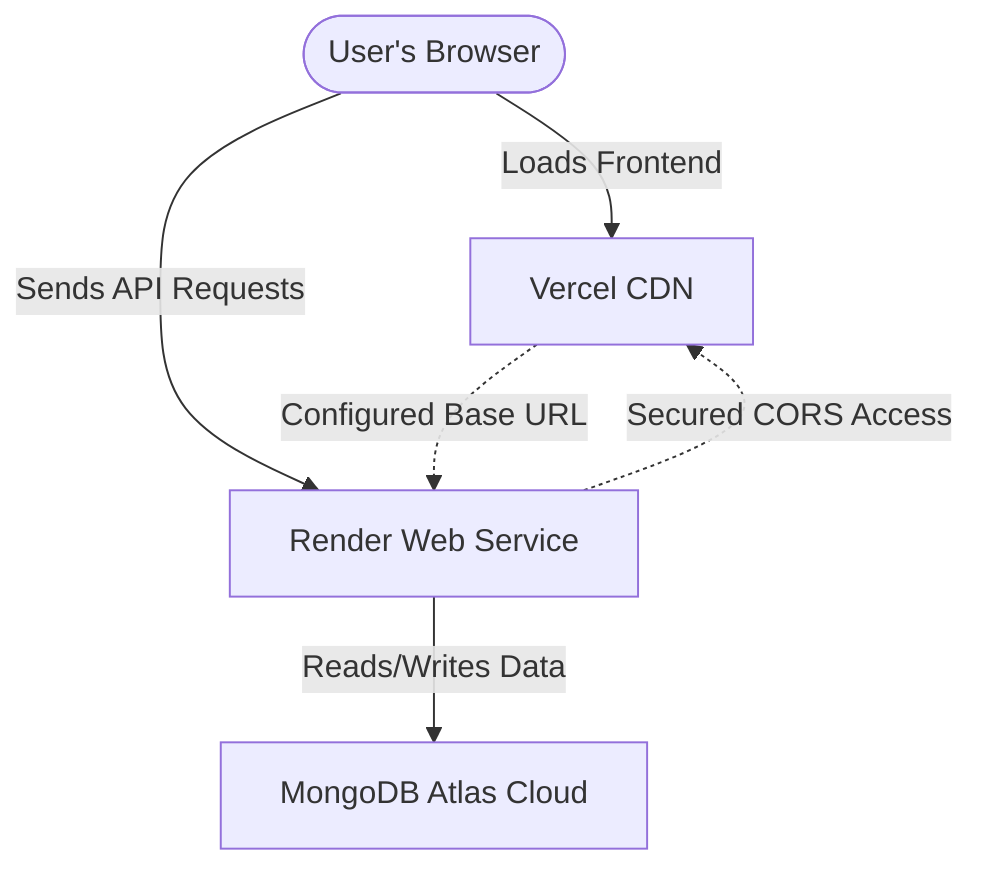

# 🚀 Production Deployment Plan: Vercel & Render

This deployment plan outlines the step-by-step process to deploy your full-stack collaborative task management application. We will deploy the **React (Vite) Frontend** on **Vercel** and the **Express/Node.js Backend API** on **Render**, backed by a cloud **MongoDB Atlas** database.

---

## 🗺️ Deployment Overview



---

## 📋 Prerequisites
Before you start, make sure you have free accounts on:
1. [GitHub](https://github.com) (To store your code repository)
2. [MongoDB Atlas](https://www.mongodb.com/products/platform/atlas-database) (For your cloud database)
3. [Render](https://render.com) (To host the backend web service)
4. [Vercel](https://vercel.com) (To host the frontend React app)

---

## 🛠️ Step 1: Push Your Code to GitHub

Both Vercel and Render deploy automatically whenever you push updates to GitHub.

1. Initialize a Git repository in your root directory (if not done already):
   ```bash
   git init
   ```
2. Add your files and commit them:
   ```bash
   git add .
   git commit -m "Configure production environment for Vercel and Render"
   ```
3. Create a new repository on GitHub and link it:
   ```bash
   git remote add origin <your-github-repo-url>
   git branch -M main
   git push -u origin main
   ```

---

## 💾 Step 2: Set Up MongoDB Atlas

Since your database is currently local, you need a hosted MongoDB database that Render can access.

1. Sign in to **MongoDB Atlas** and create a new **Free M0 Cluster**.
2. Under **Database Access**, create a database user. Copy and save the username and password.
3. Under **Network Access**, click **Add IP Address** and select **Allow Access from Anywhere** (`0.0.0.0/0`).
   > [!IMPORTANT]
   > Since Render web services use dynamic IP addresses, you **must** allow access from `0.0.0.0/0` so that Render can connect to your MongoDB database.
4. Go to **Database**, click **Connect**, select **Drivers**, and copy your connection string. It will look like this:
   ```text
   mongodb+srv://<username>:<password>@cluster0.xxxxxx.mongodb.net/?retryWrites=true&w=majority&appName=Cluster0
   ```
5. Replace `<password>` in the connection string with the database user's password you created in step 2. Keep this string safe!

---

## 🛰️ Step 3: Deploy the Backend on Render

We have created a [render.yaml](file:///c:/Users/Shravan/teamtaskmanagerproject/render.yaml) file in the root of your workspace. This defines your backend infrastructure as code, making deployment fast and error-free.

### Option A: Using Render Blueprints (Recommended & Simplest)
1. Go to your **Render Dashboard** and click **New** -> **Blueprint**.
2. Connect your GitHub repository.
3. Render will read the [render.yaml](file:///c:/Users/Shravan/teamtaskmanagerproject/render.yaml) file automatically.
4. Provide the following environment variables when prompted:
   - **`MONGO_URI`**: The connection string from MongoDB Atlas (copied in Step 2).
   - **`FRONTEND_URL`**: Leave blank for now (we will update it after deploying the frontend on Vercel).
   - **`SMTP_USER`**: Your Gmail address.
   - **`SMTP_PASSWORD`**: Your 16-character Google App Password.
5. Click **Apply**. Render will automatically build and launch your backend!

### Option B: Manual Web Service Setup
If you prefer to configure the web service manually in the Render dashboard:
1. Click **New** -> **Web Service** and connect your GitHub repository.
2. Configure the settings:
   - **Name**: `synapse-backend`
   - **Environment**: `Node`
   - **Root Directory**: `backend`
   - **Build Command**: `npm install`
   - **Start Command**: `npm start`
3. Click **Advanced** and add the following **Environment Variables**:

| Variable Key | Value | Description |
| :--- | :--- | :--- |
| `NODE_ENV` | `production` | Enables production optimizations. |
| `PORT` | `5000` | The port the Express server listens on. |
| `MONGO_URI` | `mongodb+srv://...` | Your MongoDB Atlas connection string. |
| `JWT_SECRET` | `your_random_secret_string` | A long, secure random key to sign JWT session tokens. |
| `FRONTEND_URL` | `*` (Update later) | The Vercel URL allowed to make requests (handles CORS). |
| `SMTP_HOST` | `smtp.gmail.com` | The Google SMTP host for sending emails. |
| `SMTP_PORT` | `587` | Secure SMTP port. |
| `SMTP_USER` | `your-email@gmail.com` | Your Gmail address. |
| `SMTP_PASSWORD` | `your-app-password` | Your 16-character Gmail App Password. |
| `SMTP_FROM` | `"Synapse Workspace" <no-reply@synapse.com>` | Sender header signature. |

4. Click **Deploy Web Service**.

Once deployed, Render will provide you with a public URL, for example:
👉 **`https://synapse-backend.onrender.com`** (Copy this URL!)

---

## 🎨 Step 4: Deploy the Frontend on Vercel

We have created a [vercel.json](file:///c:/Users/Shravan/teamtaskmanagerproject/frontend/vercel.json) file in your `frontend` directory to handle React Client-side Routing.

1. Go to your **Vercel Dashboard**, click **Add New**, and select **Project**.
2. Import your GitHub repository.
3. In the configuration page, adjust the following settings:
   - **Framework Preset**: Select **Vite** (Vercel usually autodetects this).
   - **Root Directory**: Click **Edit** and select the **`frontend`** directory.
     > [!IMPORTANT]
     > You must set the Root Directory to `frontend` so Vercel builds the React application correctly rather than the root monorepo.
4. Expand **Build and Development Settings** and verify:
   - **Build Command**: `npm run build`
   - **Output Directory**: `dist`
5. Expand **Environment Variables** and add:
   - **Key**: `VITE_API_URL`
   - **Value**: `https://your-backend-render-url.onrender.com/api` (The Render URL copied from Step 3, suffixed with `/api`)
6. Click **Deploy**. Vercel will build your React application and publish it.

Once deployed, Vercel will provide you with a production URL, for example:
👉 **`https://synapse-workspace.vercel.app`** (Copy this URL!)

---

## 🔗 Step 5: Secure CORS and Link the Apps Together

To secure your API and allow your frontend to successfully communicate with your backend, you must configure CORS on Render.

1. Go to your **Render Dashboard** and select your backend Web Service.
2. Navigate to **Environment**.
3. Locate the **`FRONTEND_URL`** variable.
4. Replace its value (currently `*` or blank) with your actual Vercel Frontend URL (e.g. `https://synapse-workspace.vercel.app`).
   > [!NOTE]
   > Do not include a trailing slash `/` at the end of the `FRONTEND_URL`.
5. Save the changes. Render will automatically redeploy your backend with the new security settings.

---

## 🔍 Verification Checklist

- [ ] **Frontend Loaded**: Open your Vercel URL. The login/register screens should load successfully.
- [ ] **Client Routing Works**: Refresh the browser page on any path other than `/` (e.g. `/register`). It should load successfully instead of returning a `404 Not Found` (managed by your [vercel.json](file:///c:/Users/Shravan/teamtaskmanagerproject/frontend/vercel.json)).
- [ ] **API Connection**: Submit the registration form. It should successfully talk to your Render backend, save the user in MongoDB Atlas, and log you into the dashboard.
- [ ] **CORS Secure**: Verify in your browser's Developer Console (Network tab) that requests to Render succeed and headers confirm `Access-Control-Allow-Origin` matches your Vercel URL.
- [ ] **E-mails Dispatched**: Create a new task or invite a team member to verify that emails are sent correctly via your Nodemailer SMTP settings.

---

## 🛠️ Post-Deployment Maintenance

Whenever you push new code to your `main` branch:
1. Vercel will automatically trigger a new frontend build and update the site.
2. Render will automatically trigger a backend build and update the API.
3. If you ever add new backend endpoints or frontend variables, remember to sync your environment settings on the respective dashboard!
